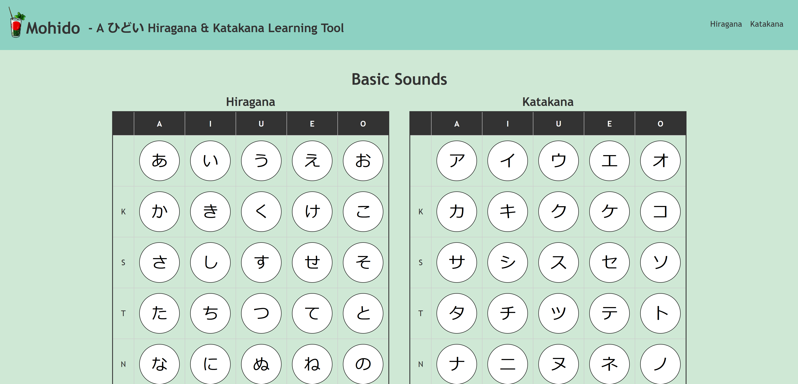

<h1 align="center">🥃 [Mohidoi](https://mohidoi.com/)</h1>

A ひどい Hiragana and Katakana learning site.

Simple and to the point web-based guide for learning and reviewing Hiragana and Katakana.

This site uses the Web Speech API for pronunciations, making it an effective quick reference guide.

  

